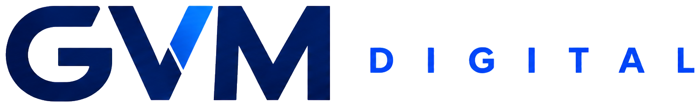

<div align="center">



# GVM Digital — Site Institucional

**Presença digital profissional para negócios que querem vender mais.**

[](https://react.dev)
[](https://vitejs.dev)
[](https://netlify.com)
[]()

[🌐 Site ao vivo](#) • [📸 Instagram](https://www.instagram.com/gvmdigital_/) • [💬 WhatsApp](https://wa.me/559284214298)

</div>

---

## 👥 Autoria

Projeto desenvolvido e mantido pelos fundadores da **GVM Digital**:

| Nome | Função | LinkedIn |
|------|--------|----------|
| **Gustavo** | Estratégia comercial | [linkedin.com/in/luís-gustavo](https://www.linkedin.com/in/lu%C3%ADs-gustavo-88a50b408/) |
| **Vítor** | Tecnologia e produto | [linkedin.com/in/vitorgrowth](https://www.linkedin.com/in/vitorgrowth/) |
| **Mayllon** | Design e operação | [linkedin.com/in/mayllon-mattos](https://www.linkedin.com/in/mayllon-mattos-336496268/) |

---

## 🛠 Stack

| Camada | Tecnologia |
|--------|-----------|
| Framework | React 19 |
| Build | Vite 7 |
| Animações | Motion (Framer) |
| Ícones | Lucide React + SVGs oficiais (BrandIcons) |
| Estilo | CSS puro com variáveis customizadas |
| Roteamento | SPA client-side (history API) |
| Deploy | Netlify (`public/_redirects`) |

---

## 📁 Estrutura do projeto

```
gvm-1/
├── assets/
│   ├── logos/               # Logos da GVM (horizontal, stacked, símbolo)
│   ├── generated/           # Imagens geradas (hero-devices)
│   └── page/                # Fotos de fundadores, portfólio e equipe
│
├── public/
│   ├── favicon.png          # Ícone do site (símbolo GVM)
│   ├── robots.txt           # Configuração para crawlers
│   ├── sitemap.xml          # Mapa do site para SEO
│   ├── 404.html             # Redirect SPA para GitHub Pages / Netlify
│   └── _redirects           # Regra Netlify: /* /index.html 200
│
├── src/
│   ├── components/
│   │   ├── BrandIcons.jsx   # SVGs oficiais: WhatsApp, Instagram, LinkedIn
│   │   ├── ButtonLink.jsx   # Botão com navegação interna
│   │   ├── CTASection.jsx   # Faixa de conversão (aparece em todas as páginas)
│   │   ├── Footer.jsx       # Rodapé global
│   │   ├── Header.jsx       # Navbar global
│   │   ├── Hero.jsx         # Hero da Home (com visual e proof)
│   │   ├── NavLink.jsx      # Link de navegação com estado ativo
│   │   ├── PageIntro.jsx    # Hero das páginas internas
│   │   ├── ProjectCard.jsx  # Card de projeto do portfólio
│   │   ├── Reveal.jsx       # Wrapper de animação scroll (IntersectionObserver)
│   │   ├── SectionHeader.jsx# Título + subtítulo de seção
│   │   ├── ServiceCard.jsx  # Card de serviço
│   │   └── Stepper.jsx      # Stepper animado (Motion) — reservado
│   │
│   ├── data/
│   │   └── content.js       # ⭐ FONTE ÚNICA DE DADOS do site
│   │
│   ├── hooks/
│   │   └── useReveal.js     # Hook do IntersectionObserver para animações
│   │
│   ├── pages/
│   │   ├── Home.jsx
│   │   ├── About.jsx        # Sobre — fundadores, história, valores
│   │   ├── Services.jsx     # Serviços — cards, detalhes, processo, FAQ
│   │   ├── Portfolio.jsx    # Portfólio — grid com filtros
│   │   ├── Contact.jsx      # Contato — formulário → WhatsApp
│   │   └── NotFound.jsx     # Página 404
│   │
│   ├── App.jsx              # Roteamento e shell da aplicação
│   ├── main.jsx             # Ponto de entrada React
│   └── styles.css           # Todos os estilos globais
│
└── index.html               # HTML raiz (meta tags, OG, favicon, fonte)
```

---

## 🚀 Rodar localmente

```bash
# Instalar dependências
npm install

# Subir servidor de desenvolvimento
npm run dev
# → http://127.0.0.1:5173

# Build de produção
npm run build

# Pré-visualizar build
npm run preview
```

---

## ✏️ Guia de mudanças comuns

> **Regra de ouro:** quase tudo que aparece no site está em `src/data/content.js`. Comece por lá.

### Alterar textos, serviços ou projetos

Abra `src/data/content.js` e edite o array correspondente:

| O que mudar | Array/objeto em `content.js` |
|-------------|------------------------------|
| Itens do menu | `navItems` |
| Cards de serviço | `services` |
| Cards do portfólio | `projects` |
| Fundadores | `founders` |
| Etapas do processo | `processSteps` |
| Diferenciais (proof points) | `proofPoints` |
| Perguntas frequentes | `faqs` |
| Métodos de contato | `contactMethods` |

### Alterar número de WhatsApp

Buscar e substituir em todo o projeto:

```
559284214298  →  55XXXXXXXXXXX
```

Ocorre em: `CTASection.jsx`, `Services.jsx`, `Contact.jsx`, `Footer.jsx`

### Alterar e-mail

Buscar e substituir:

```
contato.gvmdigital@gmail.com  →  novo@email.com
```

Ocorre em: `content.js` (contactMethods), `Footer.jsx`

### Adicionar/remover serviço

Em `content.js`, adicionar objeto ao array `services`:

```js
{
  title: "Nome do Serviço",
  icon: NomeDoIcone,       // importar de lucide-react
  summary: "Descrição curta exibida no card.",
  details: ["Item 1", "Item 2", "Item 3", "Item 4"]
}
```

### Adicionar projeto ao portfólio

1. Adicionar a imagem em `assets/page/portfolio-card-nome.png`
2. Registrar o asset em `content.js` → objeto `assets.projects`
3. Adicionar objeto ao array `projects`:

```js
{
  title: "Nome do Projeto",
  type: "Tipo exibido no card",
  category: "Projetos reais",  // usado no filtro
  tags: ["Tag1", "Tag2"],
  image: assets.projects.nome,
  description: "Descrição do projeto."
}
```

> Categorias de filtro disponíveis: `"Projetos reais"`, `"Protótipos"`, `"Plataformas"`, `"Automação"`

### Alterar foto de fundador

Substituir o arquivo correspondente em `assets/page/`:

```
founder-gustavo.png
founder-vitor.png
founder-mayllon.png
```

Manter o mesmo nome de arquivo — o asset é referenciado automaticamente.

### Adicionar ícone de rede social ao rodapé

Em `Footer.jsx`, adicionar um `<a>` na `.social-row`:

```jsx
<a href="https://..." target="_blank" rel="noreferrer" aria-label="Nome da rede">
  <NomeDoIcone size={18} />
</a>
```

Para redes com ícone oficial (Instagram, WhatsApp, LinkedIn) usar `BrandIcons.jsx`. Para outras, usar Lucide React.

### Alterar cores globais

Em `src/styles.css`, bloco `:root` no início do arquivo:

```css
:root {
  --blue-600: #005bff;   /* azul principal */
  --navy-900: #06123a;   /* azul escuro / fundo dark */
  --soft: #f5f7ff;       /* fundo suave */
  --white: #ffffff;
  --muted: #3d4b6b;      /* texto secundário */
  --line: #e4e9f5;       /* bordas */
}
```

---

## 📋 O que ainda está pendente

### 🔴 Prioritário

- [ ] **Meta tags dinâmicas por página** — atualmente todas as páginas compartilham o mesmo `<title>` e `<meta description>`. Implementar `document.title` + meta via `useEffect` em cada página, ou migrar para SSG (Astro/Next.js)
- [ ] **Integração de formulário real** — o formulário monta a mensagem e abre o WhatsApp, mas não armazena os dados em nenhum lugar. Integrar com [Formspree](https://formspree.io), [EmailJS](https://emailjs.com) ou Supabase para receber os dados também por e-mail
- [ ] **LinkedIn da empresa** — não há perfil de empresa. Criar página no LinkedIn e adicionar ao rodapé

### 🟡 Importante

- [ ] **Depoimentos de clientes** — seção de `testimonials` na Home ou na página Sobre (reforça credibilidade)
- [ ] **Preload das imagens hero** — adicionar `<link rel="preload" as="image">` no `index.html` para `hero-devices.png` e `office-team.png` (melhora LCP / Core Web Vitals)
- [ ] **OG image personalizada** — atualmente o preview de compartilhamento usa o favicon. Criar uma imagem 1200×630px específica para compartilhamento no WhatsApp/Instagram/LinkedIn
- [ ] **Google Analytics / Meta Pixel** — sem rastreamento de visitas ou conversões

### 🔵 Melhorias futuras

- [ ] **Blog / Conteúdo** — seção de artigos para SEO orgânico
- [ ] **Domínio e HTTPS confirmados** — atualizar `sitemap.xml` e `robots.txt` com a URL real de produção (atualmente `gvmdigital.com.br`)
- [ ] **PWA / Manifest** — adicionar `manifest.json` para instalação como app no celular
- [ ] **Lazy loading dos assets de portfólio** — as imagens já têm `loading="lazy"`, mas pode ser otimizado com `srcset` responsivo

---

## 🌐 Deploy

O site é um SPA (Single Page Application) hospedado no **Netlify**.

O arquivo `public/_redirects` garante que todas as rotas (ex: `/servicos`, `/portfolio`) funcionem corretamente ao ser acessadas diretamente ou ao recarregar a página:

```
/* /index.html 200
```

Para fazer deploy após alterações:

```bash
# Commitar e enviar para o GitHub
git add .
git commit -m "descrição das mudanças"
git push origin main
# O Netlify detecta o push e faz o deploy automaticamente
```

---

## 📞 Contato GVM Digital

| Canal | Endereço |
|-------|----------|
| E-mail | contato.gvmdigital@gmail.com |
| WhatsApp | +55 (92) 8421-4298 |
| Instagram | [@gvmdigital_](https://www.instagram.com/gvmdigital_/) |

---

<div align="center">

Feito com dedicação pela equipe **GVM Digital** · © 2026

</div>
